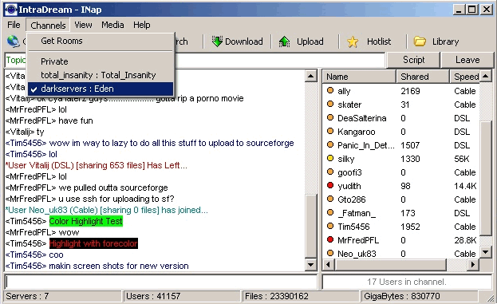



## INap 1\.02 Napster Client

### Description

9/3 Updates

Set Version 1.02-

Removed MediaPlayer MP3 Player

(was slowing it dwn and plain f-ing everything)

Plays with external player on DblClick

FIXED and Tested on windows 98se

FIXED Download Resume File.

FIXED Upload Resume Files.

FIXED Speed settings (really did this time)

The problem was i forgot 33.6 before.. oops

NEW Options

One Upload Slot Per User+

Share Downloaded Files+

Confirm on exit+

Upload Speed limiting +
 
### More Info
 

             |
---                |---
**Submitted On**   |2003-09-04 14:02:22
**By**             |[Timothy Marin](https://github.com/Planet-Source-Code/PSCIndex/blob/master/ByAuthor/timothy-marin.md)
**Level**          |Advanced
**User Rating**    |5.0 (10 globes from 2 users)
**Compatibility**  |VB 6\.0
**Category**       |[Complete Applications](https://github.com/Planet-Source-Code/PSCIndex/blob/master/ByCategory/complete-applications__1-27.md)
**World**          |[Visual Basic](https://github.com/Planet-Source-Code/PSCIndex/blob/master/ByWorld/visual-basic.md)
**Archive File**   |[INap\_1\_02\_164105942003\.zip](https://github.com/Planet-Source-Code/timothy-marin-inap-1-02-napster-client__1-48258/archive/master.zip)

